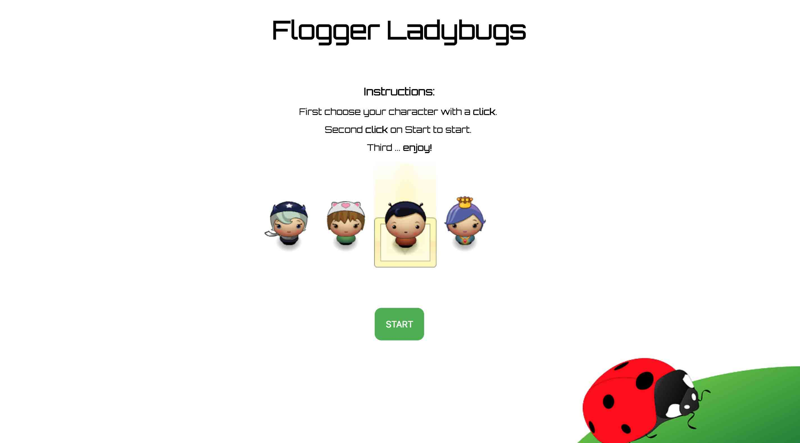
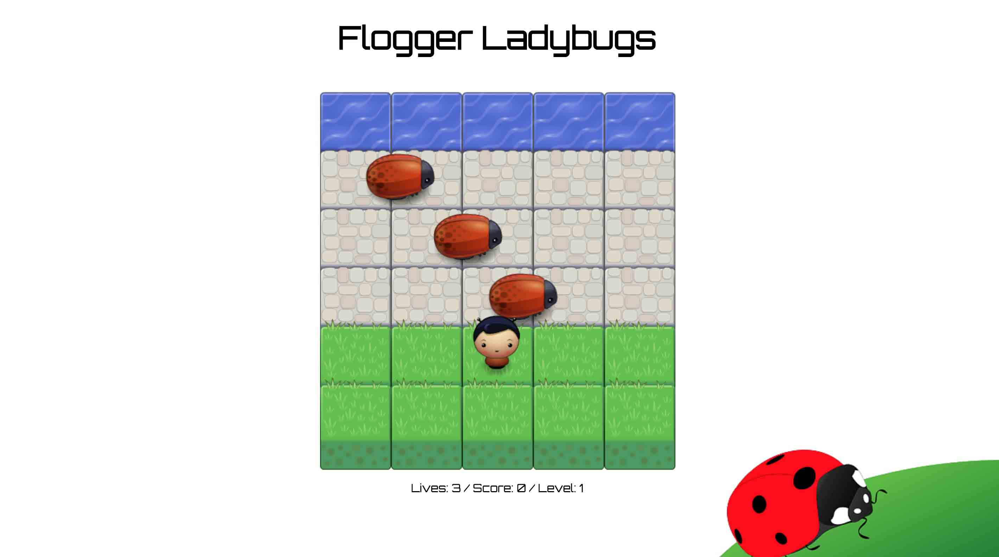

Frontend nanodegree arcade game
===============================
       
       

##Game Frogger Ladybugs

This is my first arcade game with JavaScript. It is part of the Udacity Front-End Web Developer Nanodegree projects.

Your implementation should at least follow the basic functionality, but you can add additional optional functionality to your game, if you wish.

## How to play
* Download and unzip the ZIP file (frontend-nanodegree-arcade-game-Beatriz).
* Open the folder.
* Double-click on index.html to open the game in your browser.

##Functionality

In this game you have a Player and Enemies (Bugs). The goal of the player is to reach the water, without colliding with any of the enemies.

To start, you must choose your favorite character on the main screen and then press the "START" button.

The player can move to the left, right, up and down. Enemies move at different speeds in the paved block portion of the scene.

Once the player collides with an enemy, the player loses a life and returns to the starting square.

Once the player reaches the water, he gains 10 points and goes to the next level where the enemies increase the speed.

The player starts the game with 3 lives and loses when he has none left.

The final message: less than 30 points, Game Over. 30 points or more, Congratulations.

##Tools / Techniques
* Object-Oriented JavaScript
* constructor functions 
* HTML5 Canvas API
* resource loading via immediately-invoked function expressions (IIFE)

